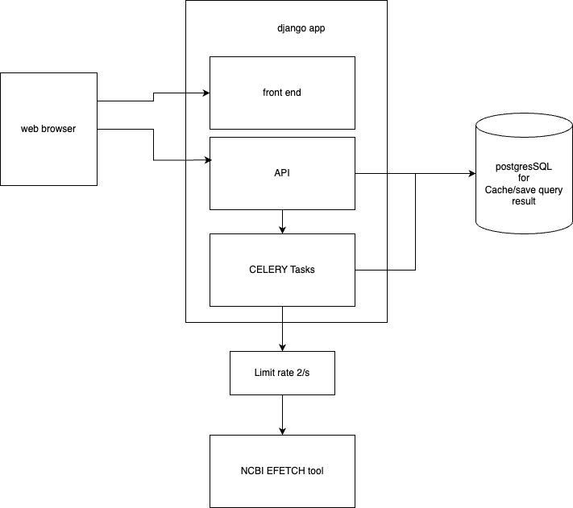

## Workflow and Feature Evolution

1. Query ID list → Get data from NCBI → Pattern search  
2. Add rate limit to avoid NCBI request throttling  
3. Add cache to store recently queried results  
4. add Celery for async task processing  
5. add compression for long sequence strings  
6. add statistical and visualization module to show motif density and save result as json  
7. add GET method to download match result as .txt

## Last version structure

## Future can do (no enough time in this time) 
1. Switch from REST API to WebSocket for real-time updates
2. Add more analysis functions in "other" panel
3. Calculate information like GC rate when download the sequence
4. Support pattern search in custom subsequence regions
5. Add support for cross-sequence motif similarity detection
