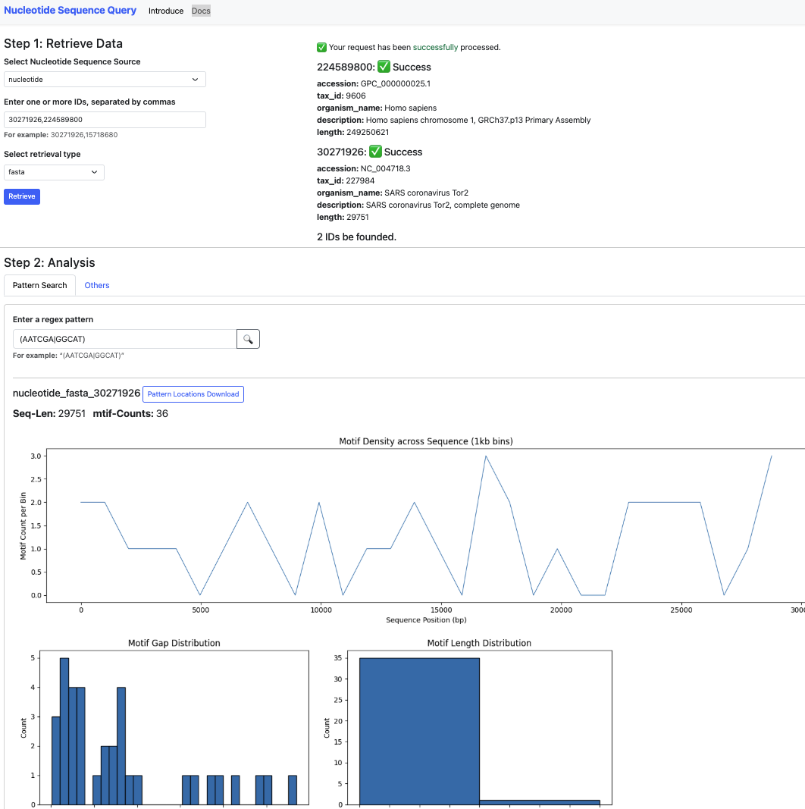

1. open browser localhost:8000/seqfetch/ -> input id , click Retrieve button.  
2. click refresh button to check the retrieving status
3. after retrieving data ready. it will show the information and Step 2
4. input pattern click search button
5. click refresh button to check status
6. after process ready. will show the plots
7. click download button to download the location of pattern match

